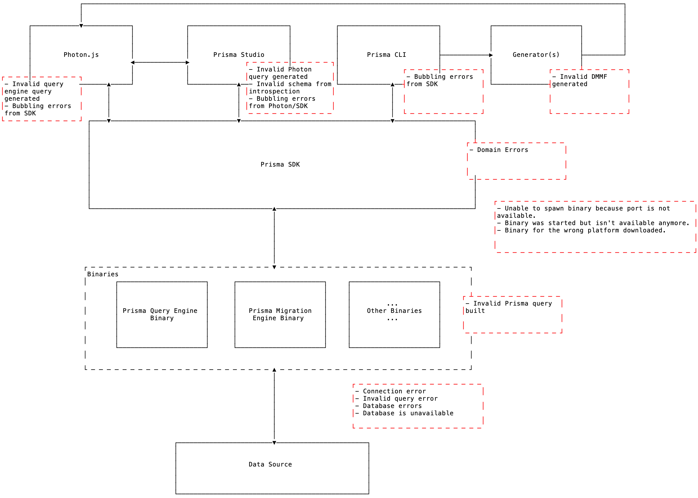

- Start Date: 2019-08-28
- RFC PR: (leave this empty)
- Prisma Issue: (leave this empty)

---

# Errors

In this document we make the distinction between [Unknown Errors](#unknown-errors) and [Known Errors](#known-errors).

<!-- toc -->

- [Motivation](#motivation)
- [Known Errors](#known-errors)
  * [Error Codes](#error-codes)
  * [List of Known Errors](#list-of-known-errors)
    + [Prisma SDK, binaries and network (between SDK-Binary and Binary-Data source)](#prisma-sdk-binaries-and-network-between-sdk-binary-and-binary-data-source)
    + [Photon.js](#photonjs)
    + [Prisma Studio](#prisma-studio)
    + [Prisma CLI](#prisma-cli)
      - [Dev](#dev)
      - [Generate](#generate)
      - [Lift](#lift)
- [Unknown Errors](#unknown-errors)
  * [Unknown Error Template](#unknown-error-template)
  * [Unknown Error Handling](#unknown-error-handling)
    + [Photon.js](#photonjs-1)
    + [Studio](#studio)
    + [CLI](#cli)
- [Error Log Masking](#error-log-masking)
- [Error Character Encoding](#error-character-encoding)

<!-- tocstop -->

# Motivation



// TODO: Move image to figma

| Component   | Description                                                           |
| ----------- | --------------------------------------------------------------------- |
| SDK Clients | Photon.js, Studio, Prisma CLI: dev, lift, generate commands, etc.     |
| Prisma SDK  | Helps tools interact with binaries. Spec [here](../sdk-js/Readme.md)  |
| Binaries    | Artifacts of Prisma 2 compilation. Spec [here](../binaries/Readme.md) |
| Data source | A database or any other data source supported by Prisma               |

Prisma 2 ecosystem provides various layers of tools that communicate with each other to provide desired outcome.

Broadly, the life-cycle of a request (Query request or CLI command) can be seen in this architecture diagram.

| SDK Client | →   | Prisma SDK | →   | Binaries | →   | Data source |
| ---------- | --- | ---------- | --- | -------- | --- | ----------- |


This document covers our error handling strategy and covers the following:

1. Known/unknown errors
2. Error log masking
3. Error character encoding

As the Prisma SDK acts as the interface between binaries and SDK clients. A lot of error handling happens in SDK layer.

# Known Errors

Whenever we show an error, we should always show a path forward towards resolution. If we don't know the path forward, we should at least link to a place to get help.

## Error Codes

Marking every known error with a structured error code prefix and a number would make error identification and parsing easier for the users.

// TODO: Dump thoughts about error codes

## List of Known Errors

The following sections(s) contain lists of currently known errors per tool. We'll update this list as more error conditions are identified.

Note that some errors might bubble at a lower layer and be presented at an upper later for developer experience.

### Prisma SDK, binaries and network (between SDK-Binary and Binary-Data source)

### Photon.js

### Prisma Studio

### Prisma CLI

#### Dev

#### Generate

#### Lift

# Unknown Errors

As Prisma 2 is still early, we're not yet aware of all error cases that can occur. This section explains what should happen when Prisma encounters an _unknown_ error.

An error can occur in any of the following tools that currently make up Prisma 2's developer surface area:

- Photon.js
- Studio
- CLI

When an unknown error occurs, **our primary goal** is to get the user to report it by creating a new GitHub issue or send the error report to us via telemetry.

Error messages should include clear guidelines of where to report the issue and what information to include. The following sections provide the templates for
these error message per tool.

## Unknown Error Template

Additionally to showing the the error message directly to the user by printing it to the console, we also want to provide rich error reports that users can use to report the issue manually via Github issue or automatically via telemetry. These error reports are stored as markdown files or zip files on the file system. Therefore, each tool has two templates:

- **Logging output** directly shown to the user
- **Error report** (markdown or a zip file) stored on the file system

The error report generally is more exhaustive than the logging output (e.g. it also contains the Prisma schema which would be overkill if printed to the terminal as well). It is also written in Markdown enabling the user to copy and paste the report as a GitHub issue directly.

## Unknown Error Handling

### Photon.js

On encountering an unexpected error, Photon should inform the user and prepare an error report with context of the issue and masked sensitive information to be shared manually or via telemetry.

<details><Summary>Logging output</Summary>

```
Oops, an unexpected error occurred.

Find more info in the error report:
**/path/to/dir/prisma-error-TIMESTAMP.md**

Please help us fix the problem!

Copy the error report and paste it as a GitHub issue here:
**https://www.github.com/prisma/photonjs/issues**

Thanks for helping us making Photon.js more stable! 🙏

An internal error occurred during invocation of **photon.users.create()** in **/path/to/dir/src/.../file.ts**

  ${userStackTrace}
```

> Note: Text enclosed by the double-asterisk `**` means the text should be printed in **bold**.

</details>

<details><Summary>Error report</Summary>

File name: `prisma-error-TIMESTAMP.md` where `TIMESTAMP` is a placeholder for the current timestamp.

```
# Error report (Photon JS | July 23, 2019 | 14:42:23 h)

This is an exhaustive report containing all relevant information about the error.

**Please post this report as a GitHub issue so we can fix the problem: https://github.com/prisma/prisma2/issues** 🙏

## Stack trace

${internalStackTrace}

## System info

${uname -a}

## Prisma 2 CLI version

${prisma2 -v}

## Prisma schema file

${schema.prisma}

## Generated Photon JS code

${index.d.ts}
```

> **Note**: The connection strings for the data sources in the Prisma schema file must be obscured!

</details>

### Studio

On encountering an unexpected error, Studio should inform the user and prepare an error report with context of the issue and masked sensitive information to be shared manually or via telemetry.

<details><Summary>Logging output</Summary>

```
Oops, an unexpected error occurred! Find more info in the error report:
**/path/to/dir/prisma-error-TIMESTAMP.md**

Please help us fix the problem!

Copy the error report and paste it as a GitHub issue here:
**https://www.github.com/prisma/prisma2/issues**

Thanks for helping us making Prisma 2 more stable! 🙏
```

> Note: Text enclosed by the double-asterisk `**` means the text should be printed in **bold**.

</details>

<details><Summary>Error report</Summary>

File name: `prisma-error-TIMESTAMP.md` where `TIMESTAMP` is a placeholder for the current timestamp.

```
# Error report (Prisma Studio | July 23, 2019 | 14:42:23 h)

This is an exhaustive report containing all relevant information about the error.

**Please post this report as a GitHub issue so we can fix the problem: https://github.com/prisma/prisma2/issues** 🙏

## Stack trace

${stacktrace}

## System info

${uname -a}

## Browser info

${browserInfo}

## Prisma 2 CLI version

${prisma2 -v}

## Prisma schema file

${schema.prisma}
```

> **Note**: The connection strings for the data sources in the Prisma schema file must be obscured!

</details>

Note that studio can also yield Photon errors as it uses Photon internally. The error log generation in that case would be done by Photon but the UI to prompt user to create a Github issue or send it to us would be handled by Studio.

// TODO: Replace this with actual Studio telemetry spec once that is available.

### CLI

On encountering an unexpected error, CLI should inform the user and prepare an error report with context of the issue and masked sensitive information to be shared manually or via telemetry.

This is covered in the [CLI telemetry spec](https://prisma-specs.netlify.com/cli/telemetry/).

// TODO: Replace this with actual CLI telemetry spec once that is available.

# Error Log Masking

Both logging output, error report might contain logs with sensitive information like database URL. Prisma 2 should mask the sensitive information (with asterisks `********`) before dumping the data on the file system.

The error report to be sent back automatically might also contain some proprietary information like the database schema via Prisma schema file.

We must ask the user before collecting such information. This is covered in the [telemetry spec](https://prisma-specs.netlify.com/cli/telemetry/).

// TODO: Replace this CLI telemetry spec link with general telemetry spec link once that is available.

# Error Character Encoding

// TODO: This probably belongs to Photon.js error handling spec but parts of it like making it parsable and error codes belong to this spec.

Photon generates pretty error messages with colors that are very useful for development as they usually pin point the issue.

However, when this data is serialized it contains a lot of unicode characters.

<details><summary>Serialized Photon error</summary>
<p>
```
Error: ^[[31mInvalid ^[[1m`const data = await photon.users.findMany()`^[[22m invocation in ^[[4m/Users/divyendusingh/Documents/prisma/p2-studio/index.js:8:37^[[24m^[[39m ^[[2m ^[[90m 4 ^[[39m^[[36mconst^[[39m photon = ^[[36mnew^[[39m Photon^[[38;2;107;139;140m(^[[39m^[[38;2;107;139;140m)^[[39m^[[22m ^[[2m ^[[90m 5 ^[[39m^[[22m ^[[2m ^[[90m 6 ^[[39m^[[36masync^[[39m ^[[36mfunction^[[39m ^[[36mmain^[[39m^[[38;2;107;139;140m(^[[39m^[[38;2;107;139;140m)^[[39m ^[[38;2;107;139;140m{^[[39m^[[22m ^[[2m ^[[90m 7 ^[[39m ^[[36mtry^[[39m ^[[38;2;107;139;140m{^[[39m^[[22m ^[[31m^[[1m→^[[22m^[[39m ^[[90m 8 ^[[39m ^[[36mconst^[[39m data = ^[[36mawait^[[39m photon^[[38;2;107;139;140m.^[[39musers^[[38;2;107;139;140m.^[[39m^[[36mfindMany^[[39m^[[38;2;107;139;140m(^[[39m{ ^[[91munknown^[[39m: ^[[2m'1'^[[22m^[[2m^[[22m ^[[91m~~~~~~~^[[39m ^[[2m^[[22m}^[[2m)^[[22m Unknown arg ^[[91m`unknown`^[[39m in ^[[1munknown^[[22m for type ^[[1mUser^[[22m. Did you mean `^[[92mskip^[[39m`? ^[[2mAvailable args:^[[22m ^[[2mtype^[[22m ^[[1m^[[2mfindManyUser^[[1m^[[22m ^[[2m{^[[22m ^[[2m^[[32mwhere^[[39m?: ^[[37mUserWhereInput^[[39m^[[22m ^[[2m^[[32morderBy^[[39m?: ^[[37mUserOrderByInput^[[39m^[[22m ^[[2m^[[32mskip^[[39m?: ^[[37mInt^[[39m^[[22m ^[[2m^[[32mafter^[[39m?: ^[[37mString^[[39m^[[22m ^[[2m^[[32mbefore^[[39m?: ^[[37mString^[[39m^[[22m ^[[2m^[[32mfirst^[[39m?: ^[[37mInt^[[39m^[[22m ^[[2m^[[32mlast^[[39m?: ^[[37mInt^[[39m^[[22m ^[[2m}^[[22m
```
</p>
</details>

There are two use cases for disabling/better structuring the error logs:

1. In Production logs, one might want to read the error messages thrown by Photon.

2. In tools like Studio, it currently strips the ANSI characters (like [this](https://codesandbox.io/s/photon-pretty-errors-m4l77)) and displays the output as the error message.

// TODO: Stripping ANSI works well but it is still not parsable. A better Photon error structure with error code and message which serializes to something like `<ERROR_CODE>: <ERROR_MESSAGE>`

To solve these two use case, Photon can do the following:

1. Respect `NODE_ENV`

This would solve the production logs use case. When `NODE_ENV` is set to `development` or is unset, Photon can emit logs with colors. However, when `NODE_ENV` is set to `production` Photon can omit colors from the logs.

2. While Point 1 might already be enough for tools like Studio as well, Photon can additionally offer `prettyLogs` as a constructor argument to switch off the pretty error logging.
